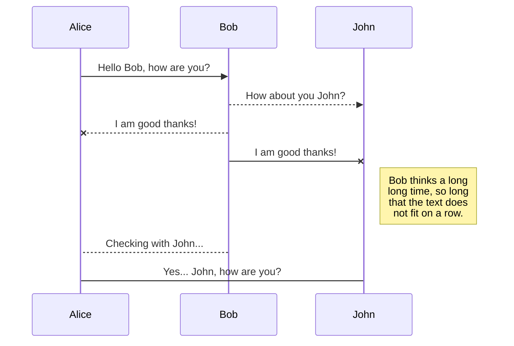
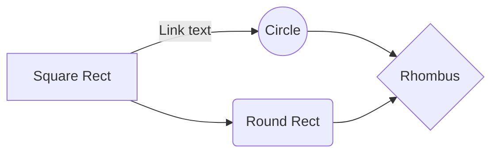

# BER-DAFT-JAN21

Class repository for the Ironhack Berlin Data Analytics Full Time class starting January 2021 (LT: Himanshu). Will contain lecture notes and lab solutions among other things.

## Table of Contents

1. [Lecture Notes and material for activities](https://github.com/n1oftheabove/BER-DAFT-JAN21/tree/main/Lessons) 

    -Inside the lessons folders you could fine the files needed for the activities and the labs in the folder called files_for_lesson_and_activities
2. [Lab Solutions](https://github.com/n1oftheabove/BER-DAFT-JAN21/tree/main/Labs/Solutions)
3. [Activities Solutions](https://github.com/n1oftheabove/BER-DAFT-JAN21/tree/main/Activities)
4. [Project Material](https://github.com/n1oftheabove/BER-DAFT-JAN21/tree/main/Projects)
4. [Extra Material](https://github.com/n1oftheabove/BER-DAFT-JAN21/tree/main/data%20books) 

    -Here you can find books, links and extra lectures that you can go trough for examples and code exercises. 
    
    
    
The *Gamma function* satisfying $\Gamma(n) = (n-1)!\quad\forall n\in\mathbb N$ is via the Euler integral

$$
\Gamma(z) = \int_0^\infty t^{z-1}e^{-t}dt\,.
$$

> You can find more information about **LaTeX** mathematical expressions [here](http://meta.math.stackexchange.com/questions/5020/mathjax-basic-tutorial-and-quick-reference).

## UML diagrams

You can render UML diagrams using [Mermaid](https://mermaidjs.github.io/). For example, this will produce a sequence diagram:

And this will produce a flow chart:

